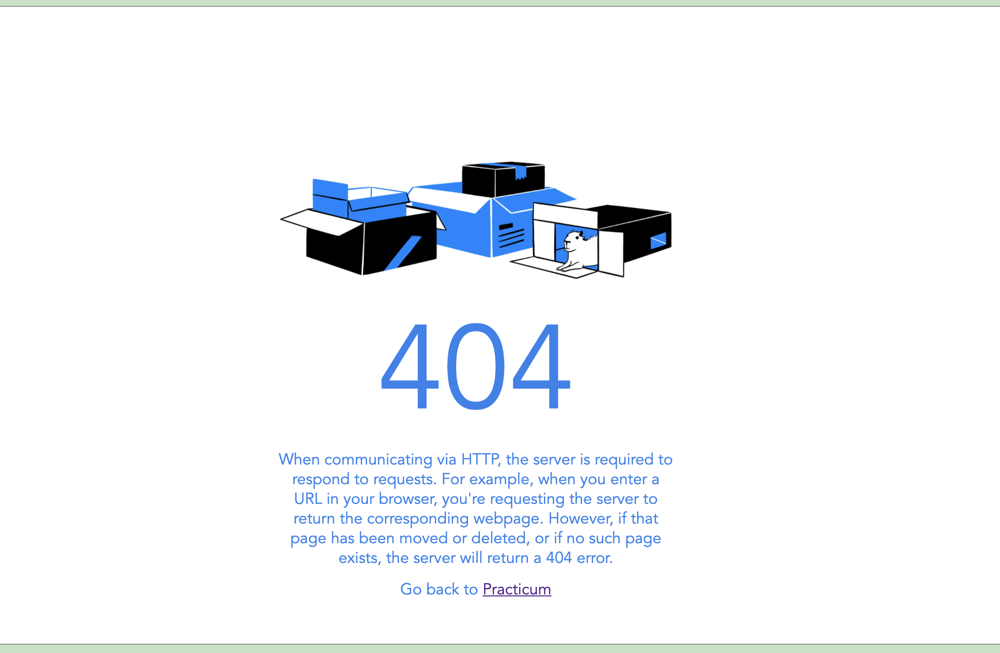

# 404 Page
> This project shows a 404 page where some text will be displayed on havor action.
> - [See live Site](https://vanisbala.github.io/404-page/)

## Table of Contents
* [General Info](#general-information)
* [Technologies Used](#technologies-used)
* [Screenshots](#screenshots)
* [Acknowledgements](#acknowledgements)
* [Contact](#contact)

## General Information
- This is a basic HTML,CSS project shows a page with text and images.
- If you hover over certain part of the page it will show some text which was invisible before
- Through this project one can understand the hover action
- It helped me to understand how to css elements and use hover action

## Technologies Used
- HTML5
- CSS3

## Screenshots

## Acknowledgements
- I did this project by the direction given from Practicum yandex's free two week curriculam.
- Many thanks to Nadya Primak who explained and walked through how to proceed with the project step by step.

## Contact
Created by Vani

